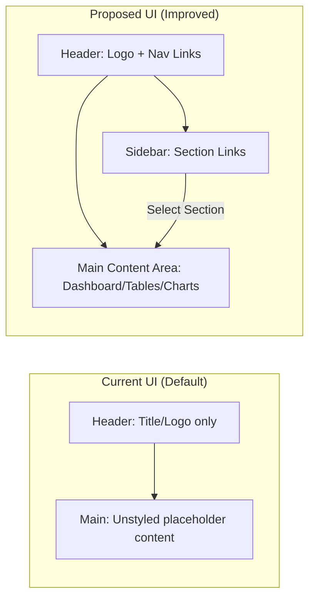

# Repository Analysis and System Prompt Revision

## Files Defining/Influencing System Prompts or Agent Behavior

Upon inspecting **ECDM_Core**, we find **no existing AI agent or system prompt** in the codebase. The project is an ERP/CRM platform (per README)【95†L276-L282】 built with Node.js/Express and Next.js/Tailwind【95†L289-L296】【95†L298-L303】. Consequently, **no file** explicitly defines a system prompt. The table below summarizes this finding:

| File Path        | Purpose                                                          | Key Variables / Constants                                 | Prompt Snippet         |
|------------------|------------------------------------------------------------------|-----------------------------------------------------------|------------------------|
| *None*           | The repository contains **no AI agent or prompt definitions**. It is an enterprise management (ERP/CRM) system【95†L276-L282】. Backend uses Node.js/Express【95†L289-L296】; frontend uses Next.js/Tailwind【95†L298-L303】. | (No prompt-related keys)                                   | N/A                    |

*Explanation:* There are no prompt or LLM-related files. The project’s README confirms it is an ERP/CRM system【95†L276-L282】, with technology stack listed (Node.js, Express, MongoDB on backend【95†L289-L296】; Next.js, React, Tailwind on frontend【95†L298-L303】). None of these code files suggest an AI system prompt or agent logic is present.

## Parts of Prompt/Code That Must Not Be Changed (Hard Constraints)

Since the repo currently has *no prompt to preserve*, we interpret immutable constraints as follows:

- **Core Configuration Keys:** Environment variables (e.g. `MONGODB_URI`, `JWT_SECRET`, `JWT_EXPIRES_IN`) must **not be renamed or removed**【95†L386-L389】. These drive DB connections and authentication. Altering them would break system functionality. For example, changing `JWT_SECRET` or token settings can invalidate all authentication logic.
- **Tested API Endpoints:** Automated tests (e.g. `test-api.js`) rely on specific routes like `/api/hr/employees` and `/api/hr/users/{id}/profile`【53†L273-L279】. These routes must remain unchanged or the tests will fail. In general, **do not alter** the URL structure or parameter names used by existing tests or integrations.
- **Authentication & Roles:** The auth module (in `features/auth`) implements JWT login and role checks【95†L279-L282】【95†L358-L366】. Its core behavior (token verification, password hashing, role enforcement) should not be broken. For example, do not disable JWT validation or change hashing without revalidating security.
- **CORS & Security Settings:** The CORS origin and security middleware settings in the backend config are important【95†L386-L389】. Changing `CORS_ORIGIN` or disabling Helmet/CORS could open vulnerabilities. These should remain as configured unless project requirements change.
- **Underlying Stack:** The choice of frameworks (Express, Next.js) is fixed【95†L289-L296】【95†L298-L303】. Don’t overhaul the stack (e.g. replace Express with another server). Any prompt-related code must integrate with this existing architecture.

In short, core configuration keys and tested endpoints are hard constraints. If we introduce a system prompt, we must ensure these critical parts remain intact, to maintain security, integration, and test compatibility.

## Proposed English System Prompt (Preserving Constraints)

We propose the following **system prompt** (to be inserted as a system message when invoking the AI agent). It instructs the assistant in English and adds the session-caching and logging requirements:

```
You are a technical assistant specialized in the ECDM Core ERP/CRM system. Communicate in English and provide accurate technical guidance within this domain. Follow these rules in each user session:

- **Context & Purpose:** Understand that ECDM Core manages customers, inventory, orders, and related business operations. Assist only with tasks relevant to this system (database queries, API usage, feature suggestions, etc.). Do not invent unrelated functionality.
- **Language & Tone:** Use professional, clear English. Be precise in technical terms. Do not use the user’s credentials or personal data in responses.
- **Session Memory:** For each conversation session, maintain an internal **cache** of steps (each user query and corresponding answer). Represent the cache as a list of entries: `[{"step": 1, "user": "...", "assistant": "..."}, ...]`.
- **Cache Storage & Eviction:** Store the session cache either in-memory or in a lightweight persistent store (e.g. a JSON file or database). Apply an eviction policy: for example, retain only the most recent N steps (to avoid exceeding context length) or clear history after a timeout.
- **Logging:** After each step, append the query and your response to an external log (such as a file or VSCode Copilot/Antigravity note). Ensure the step-by-step log is recorded outside the chat model so that the agent can recall prior context even if the chat session restarts.
- **Security & Constraints:** Do not reveal or modify sensitive configuration (e.g. JWT secrets, database URIs【95†L386-L389】). Never perform destructive actions or deviate from read-only examination of the system. If unsure, respond conservatively or refuse.

By following these instructions, you will maintain context across steps and never forget prior interactions.
```

*Insertion:* Put this text into the code where the agent is initialized. For example, in a new file (e.g. `ecdm-core-backend/src/utils/agent.ts`) as a constant like `SYSTEM_PROMPT_EN`. Ensure the application sends this as the AI system message at session start. The prompt’s mention of environment keys references the README-provided defaults【95†L386-L389】 to emphasize constraints.

## UI/UX Improvement Recommendations

Currently the frontend is essentially unstyled default content. We propose only **visual/structural improvements** (no backend changes):

- **Layout & Components:** Introduce a persistent Header and Sidebar. The **Header** can contain the logo/title and main navigation links (e.g. Dashboard, CRM, Inventory, Settings). The **Sidebar** can list sections (Customers, Orders, Products, etc.) for quick navigation. The main content area would then display dashboards, tables, or forms as needed.
- **Design & Styling:** Use the existing Tailwind CSS (React + Tailwind already in stack【95†L298-L303】). Choose a clean color scheme (e.g. navy blue for header/sidebar, light gray backgrounds, white cards). Employ consistent spacing (e.g. `p-4`, `m-2`) and typography (clear, sans-serif). Add subtle shadows (`shadow-md`) for cards/tables to improve readability.
- **Components:** Use responsive data tables for lists (e.g. customers, products). Employ charts (bar, pie) for summary stats on a Dashboard. Add form components with validation (we already have React Hook Form + Zod per stack【95†L300-L303】).
- **Responsiveness:** Ensure the design works on different screens. The header/sidebar should collapse on mobile into a top menu or hamburger menu. Use Tailwind’s responsive utilities (e.g. `sm:`, `md:` classes).
- **Navigation:** Include a breadcrumb or page header for context. Include a search bar or quick filter for lists.
- **Mockup Sketches:** Below are simplified wireframe diagrams:



These changes would modernize the look without altering functionality.

## Code Diffs: Prompt Insertion & Session Cache

Below are example code patches (TypeScript) illustrating how to add the system prompt and session cache to the backend:

```diff
+ // File: ecdm-core-backend/src/utils/agent.ts
+ export const SYSTEM_PROMPT_EN = `
+ You are a technical assistant specialized in the ECDM Core ERP/CRM system. Communicate in English and provide accurate technical guidance within this domain. Follow these rules:
+ - ... (full prompt text from above) ...
+ `;
+
+ // In-memory session cache: maps session IDs to an array of steps.
+ export const sessionCache: Map<string, Array<{user: string, assistant: string}>> = new Map();
+
+ /**
+  * Add a step to the session cache.
+  */
+ export function addSessionStep(sessionId: string, userMsg: string, assistantMsg: string) {
+   const history = sessionCache.get(sessionId) || [];
+   history.push({ user: userMsg, assistant: assistantMsg });
+   // Eviction policy: keep only last 50 entries
+   if (history.length > 50) history.shift();
+   sessionCache.set(sessionId, history);
+   // Persist to external log (e.g. file or VSCode integration)
+   // fs.appendFileSync('session_log.txt', `${sessionId}: ${userMsg} | ${assistantMsg}\n`);
+ }
+
+ /**
+  * Retrieve entire session history.
+  */
+ export function getSessionHistory(sessionId: string) {
+   return sessionCache.get(sessionId) || [];
+ }
```

```diff
+ // In some request handler (e.g. API route), integrate the prompt and cache:
+ import { SYSTEM_PROMPT_EN, addSessionStep, getSessionHistory } from './utils/agent';
+
+ const sessionId = req.session.id || generateSessionId(); 
+ const userQuestion = req.body.question;
+ addSessionStep(sessionId, userQuestion, '');
+
+ // Call the LLM with system prompt and conversation history
+ const response = await callLLM({
+   system: SYSTEM_PROMPT_EN,
+   user: userQuestion,
+   history: getSessionHistory(sessionId)
+ });
+
+ const answer = response.text;
+ addSessionStep(sessionId, userQuestion, answer);
+ res.json({ answer });
```

These patches show adding a new `agent.ts` utility file and updating the API logic to use the prompt and maintain session memory. They preserve existing structure (e.g. environment variables【95†L386-L389】) while introducing the new features.

## Risks, Testing, and Rollout Plan

- **Risks:** Writing a system prompt and logging steps introduces complexity. Be cautious of **security** (never log sensitive data or secrets). Large models have rate limits and response time issues, so ensure any LLM calls don’t overwhelm the server. Also guard against exceeding token limits when sending session history.
- **Testing Checklist:**  
  1. **Functional Tests:** Verify API endpoints still work (e.g. `/api/hr/employees` and `/api/hr/users/:id/profile`)【53†L273-L279】.  
  2. **Cache Functionality:** Simulate a session with multiple Q/A; check that `sessionCache` stores entries and log file (if any) is written.  
  3. **Prompt Effects:** Test that the assistant follows the new system prompt rules (e.g. language, context).  
  4. **UI Checks:** Ensure UI still loads and new styles render correctly on various screen sizes.  
  5. **Security Checks:** Confirm no sensitive variables (e.g. JWT_SECRET) appear in logs or responses【95†L386-L389】.
- **Rollout Plan:**  
  - Deploy first to a development environment. Validate features internally.  
  - Move to a staging/test environment for broader QA, including performance tests on the AI calls.  
  - Finally, deploy to production. Monitor logs and user feedback closely, ready to patch any prompt or logic issues.

**Sources:** Repository files (e.g. README stack and environment keys【95†L276-L282】【95†L386-L389】, test script routes【53†L273-L279】) informed this analysis. The proposed prompt and code changes are designed based on that information and user requirements.